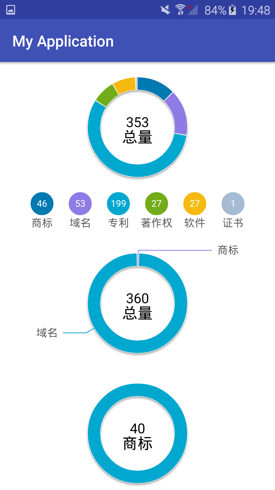

**How to use PieChart

+ in your Layout, add these line:

最小高度需要设置170dp（根据视觉稿调整的高度）
<pre> &lt;com.intsig.view.PieChart
        android:id="@+id/pie_chart"
        android:layout_width="match_parent"
        android:layout_height="wrap_content"
        android:minHeight="170dp"/&gt;
</pre>

+ In Activity, add Data:

<pre>
 PieChart pieChar = (PieChart)findViewById(R.id.pie_chart);
 pieChar.setData(new String[]{"商标","域名","专利","著作权","软件","证书"},new int[]{40,53,199,27,27,8},"All");
// 或者这样
 ArrayList<PieChart.Entry> tmp = new ArrayList<>();
        tmp.add(new PieChart.Entry("商标",1));//trademark
        tmp.add(new PieChart.Entry("域名",50));
        tmp.add(new PieChart.Entry("专利",53)); //patent
        tmp.add(new PieChart.Entry("copyright",8));//著作权
        pieChar.setData(tmp,"总量");
</pre>

